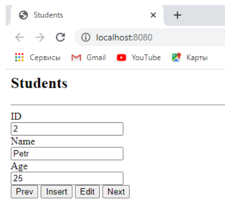

<h1>Task 8</h1>

Необходимо создать простейшее клиент-серверное web-приложение

<strong>Требования:</strong>

<ul>
  <li>Серверную часть реализовать с помощью Node.js.</li>
  <li>Создать класс, содержащий информацию о студенте (id, firstName, secondName, age, speciality).</li>
  <li>Создать на стороне сервера JSON с информацией о студентах.</li>
  <li>Создать HTML-документ, реализующий CRUD для списка студентов.</li>
  <li>Все обновление информации на стороне клиента реализовать через AJAX запросы.</li>
  <li>Серверная часть должна обеспечивать выполнение запросов клиента и обновление данных в JSON файле.</li>
</ul>
